# 🚑 Rapid-Rescue

**Full-stack emergency response platform with real-time AI accident detection**

[](https://python.org)
[](https://djangoproject.com)
[](https://reactjs.org)
[](LICENSE)

## 📋 Table of Contents

- [Overview](#overview)
- [Features](#features)
- [Architecture](#architecture)
- [Tech Stack](#tech-stack)
- [Prerequisites](#prerequisites)
- [Installation](#installation)
- [Quick Start](#quick-start)
- [Project Structure](#project-structure)
- [API Documentation](#api-documentation)
- [AI Accident Detection](#ai-accident-detection)
- [Usage Guide](#usage-guide)
- [Configuration](#configuration)
- [Deployment](#deployment)
- [Contributing](#contributing)
- [📸 Screenshots](#Screenshots)

## 🎯 Overview

Rapid-Rescue is a comprehensive emergency response management system that combines real-time AI-powered accident detection with a full-stack web application for coordinating emergency medical services. The system automatically detects accidents through computer vision and immediately alerts emergency services, enabling rapid response coordination.

### Key Capabilities

- **Real-time AI Accident Detection**: Computer vision system using ONNX Runtime and OpenCV
- **Emergency Response Coordination**: Complete ambulance and driver management system
- **Live Navigation**: Real-time GPS tracking and route optimization
- **Analytics Dashboard**: Comprehensive emergency response analytics
- **Multi-role Access**: Separate interfaces for administrators and drivers
- **JWT Authentication**: Secure authentication with role-based access control

## ✨ Features

### 🚨 Emergency Management

- **Real-time Alert System**: Instant accident detection and alert generation
- **Automated Response**: Automatic assignment of nearest available ambulance
- **Priority Management**: Intelligent alert prioritization based on severity
- **Response Tracking**: Real-time status updates and response time monitoring

### 🚑 Ambulance Fleet Management

- **Fleet Tracking**: Real-time GPS location tracking of all ambulances
- **Driver Management**: Comprehensive driver profiles and status management
- **Vehicle Assignment**: Intelligent ambulance-to-incident assignment
- **Maintenance Tracking**: Vehicle status and maintenance scheduling

### 📊 Analytics & Reporting

- **Response Analytics**: Response time analysis and performance metrics
- **Incident Statistics**: Comprehensive accident and emergency statistics
- **Performance Dashboards**: Real-time operational metrics
- **Historical Data**: Long-term trend analysis and reporting

### 🗺️ Navigation & Mapping

- **Google Maps Integration**: Full Google Maps API integration
- **Route Optimization**: Real-time route calculation and optimization
- **Live Tracking**: Real-time ambulance and driver location tracking
- **Geospatial Analytics**: Location-based incident analysis

### 🔐 Security & Authentication

- **JWT Authentication**: Secure token-based authentication
- **Role-based Access**: Separate admin and driver interfaces
- **API Security**: Protected REST API endpoints
- **Data Encryption**: Secure data transmission and storage

## 🏗️ Architecture

```
┌─────────────────────────────────────────────────────────────┐
│                    Frontend (React)                        │
│  ┌─────────────┐ ┌─────────────┐ ┌─────────────┐         │
│  │   Admin     │ │   Driver    │ │  Analytics  │         │
│  │  Dashboard  │ │  Interface  │ │  Dashboard  │         │
│  └─────────────┘ └─────────────┘ └─────────────┘         │
└─────────────────────────────────────────────────────────────┘
                              │
                              ▼
┌─────────────────────────────────────────────────────────────┐
│                   Backend (Django)                         │
│  ┌─────────────┐ ┌─────────────┐ ┌─────────────┐         │
│  │  REST API   │ │  Database   │ │  JWT Auth   │         │
│  │  Endpoints  │ │  (SQLite)   │ │  System     │         │
│  └─────────────┘ └─────────────┘ └─────────────┘         │
└─────────────────────────────────────────────────────────────┘
                              │
                              ▼
┌─────────────────────────────────────────────────────────────┐
│                AI Accident Detection                        │
│  ┌─────────────┐ ┌─────────────┐ ┌─────────────┐         │
│  │  Computer   │ │   ONNX      │ │  Alert      │         │
│  │   Vision    │ │  Runtime    │ │  Sender     │         │
│  └─────────────┘ └─────────────┘ └─────────────┘         │
└─────────────────────────────────────────────────────────────┘
```

## 🛠️ Tech Stack

### Backend

- **Framework**: Django 5.1.4
- **API**: Django REST Framework 3.15.0
- **Authentication**: JWT (djangorestframework-simplejwt)
- **Database**: SQLite (development) / PostgreSQL (production)
- **CORS**: django-cors-headers
- **Documentation**: drf-yasg (Swagger/OpenAPI)

### Frontend

- **Framework**: React 18.2.0
- **Build Tool**: Vite 5.0.0
- **Routing**: React Router DOM 6.20.1
- **UI Components**: React Bootstrap 2.10.9
- **Maps**: @react-google-maps/api 2.20.5
- **Charts**: Chart.js 4.4.9 + react-chartjs-2 5.3.0
- **HTTP Client**: Axios 1.6.2

### AI/ML Components

- **Computer Vision**: OpenCV 4.8.0+
- **ML Runtime**: ONNX Runtime 1.15.0+
- **Deep Learning**: Custom ONNX model for accident detection
- **Image Processing**: Pillow 10.0.0+
- **Data Processing**: NumPy 1.24.0+, Pandas 2.0.0+

### Development Tools

- **Package Manager**: npm 8+ / pip
- **Version Control**: Git
- **Environment**: Python 3.9+, Node.js 16+
- **Scripts**: PowerShell (Windows)

## 📋 Prerequisites

Before running this application, ensure you have the following installed:

- **Python 3.9+**
- **Node.js 16+**
- **npm 8+**
- **Windows PowerShell 5.1+** (for Windows users)
- **Git**

### System Requirements

- **RAM**: Minimum 4GB, Recommended 8GB+
- **Storage**: 2GB+ free space
- **GPU**: Optional (CUDA support for GPU acceleration)
- **Internet**: Required for Google Maps API and package installation

## 🚀 Installation

### Option 1: Automated Setup (Recommended)

1. **Clone the repository**

   ```bash
   git clone https://github.com/Talha-229/Rapid-Rescue.git
   cd Rapid-Rescue
   ```

2. **Run the automated setup script**

   ```powershell
   # Windows PowerShell
   .\Rapid-Rescue-main\start-all.ps1
   ```

   This script will:

   - Install Python dependencies
   - Set up virtual environment
   - Install Node.js dependencies
   - Run database migrations
   - Start both backend and frontend servers

### Option 2: Manual Setup

#### Backend Setup

1. **Navigate to backend directory**

   ```bash
   cd Rapid-Rescue-main/backend
   ```

2. **Create virtual environment**

   ```bash
   python -m venv venv
   .\venv\Scripts\Activate.ps1  # Windows
   source venv/bin/activate     # Linux/Mac
   ```

3. **Install dependencies**

   ```bash
   pip install -r requirements.txt
   ```

4. **Run migrations**

   ```bash
   python manage.py migrate
   ```

5. **Create admin user**
   ```bash
   python manage.py createsuperuser
   ```

#### Frontend Setup

1. **Navigate to frontend directory**

   ```bash
   cd Rapid-Rescue-main/frontend
   ```

2. **Install dependencies**

   ```bash
   npm install
   ```

3. **Start development server**
   ```bash
   npm run dev
   ```

## 🏃‍♂️ Quick Start

1. **Start the application**

   ```powershell
   .\Rapid-Rescue-main\start-all.ps1
   ```

2. **Access the application**

   - Frontend: http://localhost:5173
   - Backend API: http://localhost:8000/api/
   - Admin Panel: http://localhost:8000/admin/

3. **Login with admin credentials**
   - Use the credentials created during setup
   - Or create a new admin user using the Django admin panel

## 📁 Project Structure

```
Rapid-Rescue/
├── README.md                           # This file
├── Rapid-Rescue-main/                  # Main application
│   ├── backend/                        # Django backend
│   │   ├── rapidrescue/               # Django project settings
│   │   ├── drivers_app/               # Driver management
│   │   ├── ambulances_app/            # Ambulance fleet management
│   │   ├── alerts_app/                # Emergency alerts
│   │   ├── accidents_app/             # Accident data
│   │   ├── authentication/            # User authentication
│   │   ├── dashboard/                 # Analytics and statistics
│   │   ├── api/                       # Legacy API endpoints
│   │   ├── manage.py                  # Django management
│   │   ├── requirements.txt           # Python dependencies
│   │   └── start-backend.ps1         # Backend startup script
│   ├── frontend/                      # React frontend
│   │   ├── src/
│   │   │   ├── components/           # React components
│   │   │   ├── pages/                # Page components
│   │   │   ├── services/             # API services
│   │   │   ├── contexts/             # React contexts
│   │   │   ├── config/               # Configuration files
│   │   │   ├── assets/               # Static assets
│   │   │   ├── App.jsx               # Main app component
│   │   │   └── main.jsx              # Entry point
│   │   ├── public/                   # Public assets
│   │   ├── package.json              # Node.js dependencies
│   │   └── vite.config.js            # Vite configuration
│   ├── COMPREHENSIVE-GUIDE.md        # Detailed documentation
│   ├── start-all.ps1                 # Complete startup script
│   └── setup-frontend-env.ps1        # Frontend setup script
├── accidentdetection-system-oncomputer/  # AI accident detection
│   ├── inference.py                   # Main inference engine
│   ├── alert_sender.py                # Alert sending system
│   ├── best.onnx                      # Trained ML model
│   ├── requirements.txt               # AI dependencies
│   └── generate_token.py              # Token generation
└── accidentdetection-on-colab/        # Google Colab notebook
    └── Inference-ngrokwithgradio.ipynb # Colab inference demo
```

## 🔌 API Documentation

### Authentication Endpoints

| Endpoint                   | Method | Description          |
| -------------------------- | ------ | -------------------- |
| `/api/auth/login/`         | POST   | Driver login         |
| `/api/auth/admin/login/`   | POST   | Admin login          |
| `/api/auth/logout/`        | POST   | Logout user          |
| `/api/auth/token/refresh/` | POST   | Refresh access token |

### Alerts Endpoints

| Endpoint            | Method | Description        |
| ------------------- | ------ | ------------------ |
| `/api/alerts/`      | GET    | List all alerts    |
| `/api/alerts/<id>/` | GET    | Get specific alert |
| `/api/alerts/`      | POST   | Create new alert   |
| `/api/alerts/<id>/` | PUT    | Update alert       |
| `/api/alerts/<id>/` | DELETE | Delete alert       |

### Drivers Endpoints

| Endpoint             | Method | Description         |
| -------------------- | ------ | ------------------- |
| `/api/drivers/`      | GET    | List all drivers    |
| `/api/drivers/<id>/` | GET    | Get specific driver |
| `/api/drivers/`      | POST   | Create new driver   |
| `/api/drivers/<id>/` | PUT    | Update driver       |
| `/api/drivers/<id>/` | DELETE | Delete driver       |

### Ambulances Endpoints

| Endpoint                | Method | Description            |
| ----------------------- | ------ | ---------------------- |
| `/api/ambulances/`      | GET    | List all ambulances    |
| `/api/ambulances/<id>/` | GET    | Get specific ambulance |
| `/api/ambulances/`      | POST   | Create new ambulance   |
| `/api/ambulances/<id>/` | PUT    | Update ambulance       |
| `/api/ambulances/<id>/` | DELETE | Delete ambulance       |

### Statistics Endpoints

| Endpoint                          | Method | Description             |
| --------------------------------- | ------ | ----------------------- |
| `/api/statistics/`                | GET    | Get system statistics   |
| `/api/statistics/response-times/` | GET    | Response time analytics |
| `/api/statistics/incidents/`      | GET    | Incident statistics     |

### Authentication

All API endpoints require JWT authentication. Include the token in the Authorization header:

```bash
Authorization: Bearer <your_jwt_token>
```

## 🤖 AI Accident Detection

The system includes a sophisticated AI-powered accident detection system:

### Components

- **Computer Vision Engine**: Real-time video processing using OpenCV
- **ML Model**: Custom ONNX model for accident detection
- **Alert System**: Automatic alert generation and dispatch
- **Video Processing**: Frame-by-frame analysis with temporal smoothing

### Features

- **Real-time Detection**: Continuous video stream analysis
- **Confidence Scoring**: AI confidence-based alert prioritization
- **Temporal Smoothing**: Reduces false positives through frame analysis
- **Video Recording**: Automatic accident clip recording
- **Alert Integration**: Seamless integration with emergency response system

### Usage

1. **Start the AI system**

   ```bash
   cd accidentdetection-system-oncomputer
   python inference.py
   ```

2. **Configure video source**

   - Webcam: Automatic detection
   - Video file: Specify file path
   - IP camera: Configure stream URL

3. **Monitor alerts**
   - Alerts automatically sent to backend
   - Real-time dashboard updates
   - Emergency response coordination

## 📖 Usage Guide

### Admin Interface

1. **Dashboard Overview**

   - Real-time system statistics
   - Active alerts and responses
   - Fleet status overview

2. **Driver Management**

   - Add/edit driver profiles
   - Assign drivers to ambulances
   - Monitor driver status

3. **Analytics**

   - Response time analysis
   - Incident statistics
   - Performance metrics

4. **Settings**
   - System configuration
   - User management
   - API key management

### Driver Interface

1. **Ambulance Dashboard**

   - Current assignments
   - Navigation assistance
   - Status updates

2. **Navigation**

   - Real-time GPS tracking
   - Route optimization
   - Turn-by-turn directions

3. **History**
   - Past assignments
   - Performance metrics
   - Incident reports

### Emergency Response Workflow

1. **Accident Detection**

   - AI system detects accident
   - Automatic alert generation
   - Video recording initiated

2. **Alert Processing**

   - Alert received by system
   - Nearest ambulance identified
   - Driver notification sent

3. **Response Coordination**

   - Driver accepts assignment
   - Route calculated automatically
   - Real-time tracking begins

4. **Status Updates**
   - Response time tracking
   - Status updates to admin
   - Completion reporting

## ⚙️ Configuration

### Environment Variables

Create a `.env` file in the backend directory:

```env
# Django Settings
SECRET_KEY=your_secret_key_here
DEBUG=True
ALLOWED_HOSTS=localhost,127.0.0.1

# Database
DATABASE_URL=sqlite:///db.sqlite3

# Google Maps API
VITE_GOOGLE_MAPS_API_KEY=your_google_maps_api_key_here

# JWT Settings
JWT_SECRET_KEY=your_jwt_secret_key_here
JWT_ACCESS_TOKEN_LIFETIME=4
JWT_REFRESH_TOKEN_LIFETIME=7

# AI Detection Settings
INFERENCE_TOKEN=your_inference_token_here
COOLDOWN_PERIOD=120
MAX_VIDEO_SIZE=10485760
```

### Google Maps API Setup

1. **Get API Key**

   - Visit [Google Cloud Console](https://console.cloud.google.com/)
   - Create a new project or select existing
   - Enable Maps JavaScript API
   - Create credentials (API key)

2. **Configure API Key**
   - Add the API key to your `.env` file
   - Restrict the key to your domain for security

### Database Configuration

#### Development (SQLite)

```python
DATABASES = {
    'default': {
        'ENGINE': 'django.db.backends.sqlite3',
        'NAME': BASE_DIR / 'db.sqlite3',
    }
}
```

#### Production (PostgreSQL)

```python
DATABASES = {
    'default': {
        'ENGINE': 'django.db.backends.postgresql',
        'NAME': 'rapid_rescue_db',
        'USER': 'your_username',
        'PASSWORD': 'your_password',
        'HOST': 'localhost',
        'PORT': '5432',
    }
}
```

## 🚀 Deployment

### Production Setup

1. **Environment Preparation**

   ```bash
   # Set production environment
   export DJANGO_SETTINGS_MODULE=rapidrescue.settings.production
   export DEBUG=False
   ```

2. **Database Migration**

   ```bash
   python manage.py migrate
   python manage.py collectstatic
   ```

3. **Web Server Setup**

   ```bash
   # Using Gunicorn
   gunicorn rapidrescue.wsgi:application --bind 0.0.0.0:8000
   ```

4. **Frontend Build**
   ```bash
   npm run build
   ```

### Docker Deployment

Create a `Dockerfile`:

```dockerfile
# Backend Dockerfile
FROM python:3.9-slim

WORKDIR /app
COPY requirements.txt .
RUN pip install -r requirements.txt

COPY . .
RUN python manage.py migrate
RUN python manage.py collectstatic --noinput

EXPOSE 8000
CMD ["gunicorn", "rapidrescue.wsgi:application", "--bind", "0.0.0.0:8000"]
```

### Security Considerations

- **HTTPS**: Always use HTTPS in production
- **API Keys**: Secure all API keys and secrets
- **Database**: Use strong passwords and proper access controls
- **Firewall**: Configure proper firewall rules
- **Backups**: Regular database and file backups
- **Monitoring**: Implement logging and monitoring

## 🤝 Contributing

We welcome contributions! Please follow these steps:

1. **Fork the repository**
2. **Create a feature branch**
   ```bash
   git checkout -b feature/your-feature-name
   ```
3. **Make your changes**
4. **Test thoroughly**
5. **Commit your changes**
   ```bash
   git commit -m "Add: your feature description"
   ```
6. **Push to your branch**
   ```bash
   git push origin feature/your-feature-name
   ```
7. **Create a Pull Request**

### Development Guidelines

- **Code Style**: Follow PEP 8 for Python, ESLint for JavaScript
- **Documentation**: Update documentation for new features
- **Testing**: Write tests for new functionality
- **Security**: Follow security best practices
- **Performance**: Optimize for performance where possible


## 🙏 Acknowledgments

- **Django Community**: For the excellent web framework
- **React Team**: For the powerful frontend library
- **OpenCV**: For computer vision capabilities
- **ONNX Runtime**: For efficient ML inference
- **Google Maps API**: For mapping and navigation features

## 📞 Support

For support and questions:

- **Issues**: [GitHub Issues](https://github.com/Talha-229/Rapid-Rescue/issues)
- **Documentation**: See [COMPREHENSIVE-GUIDE.md](Rapid-Rescue-main/COMPREHENSIVE-GUIDE.md)
- **Email**: javedtalha339@gmail.com

## 📸 Screenshots

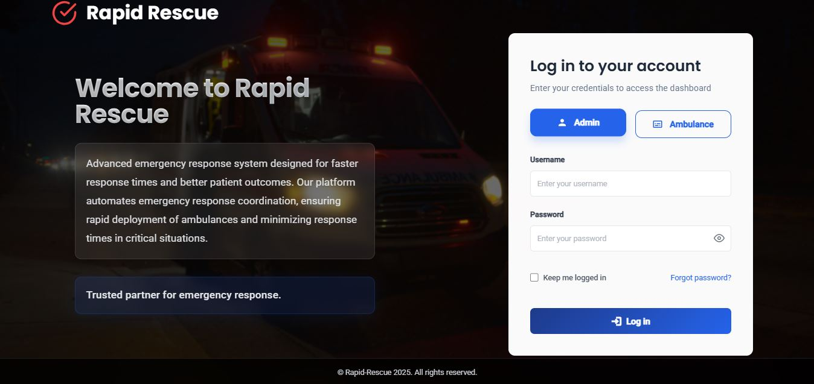
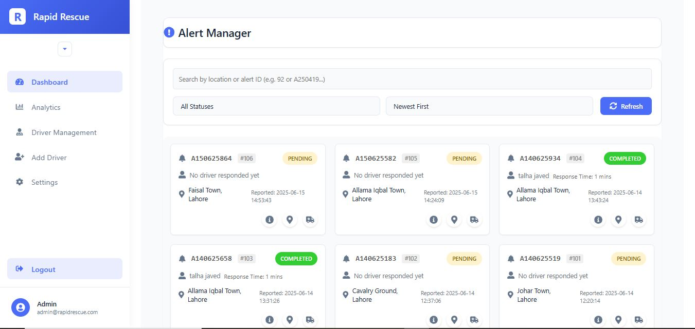
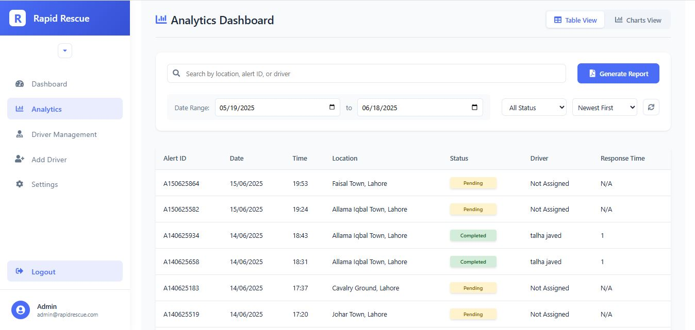
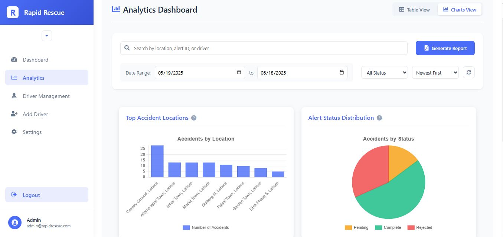
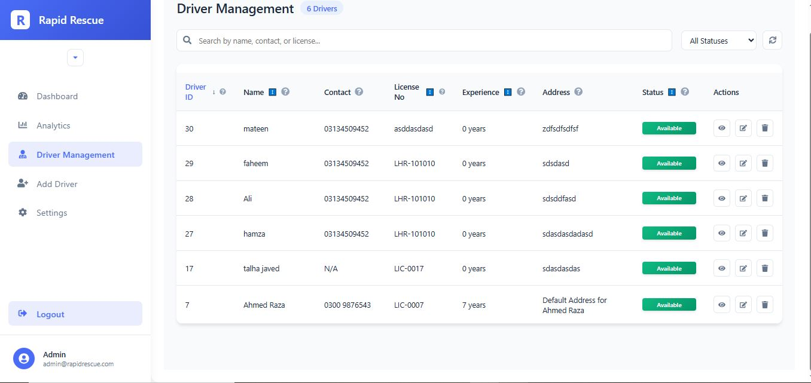
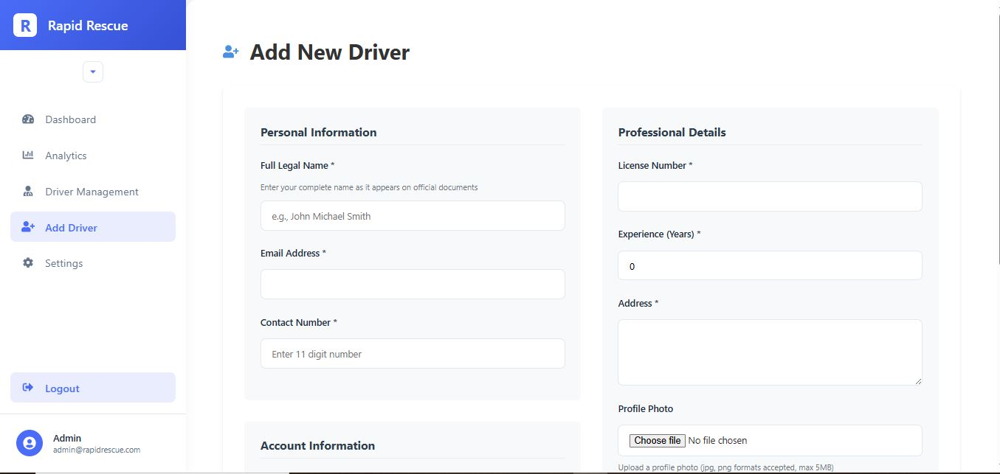
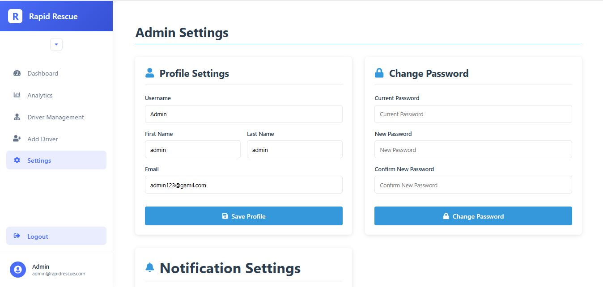
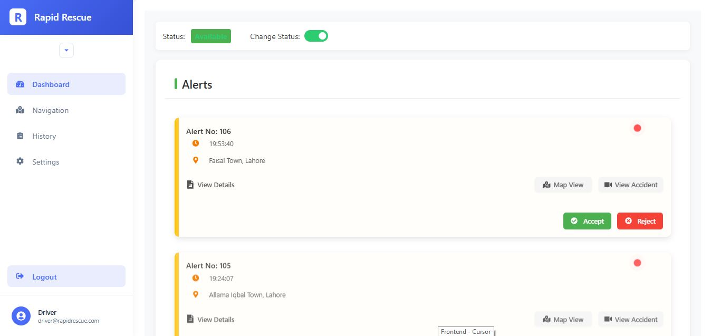
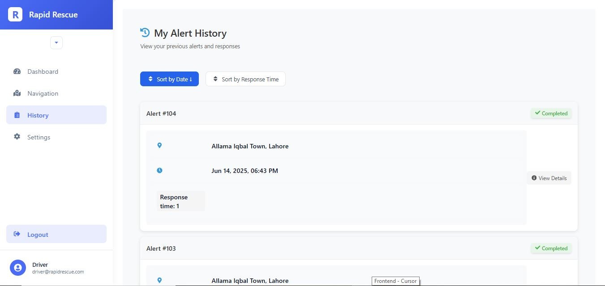
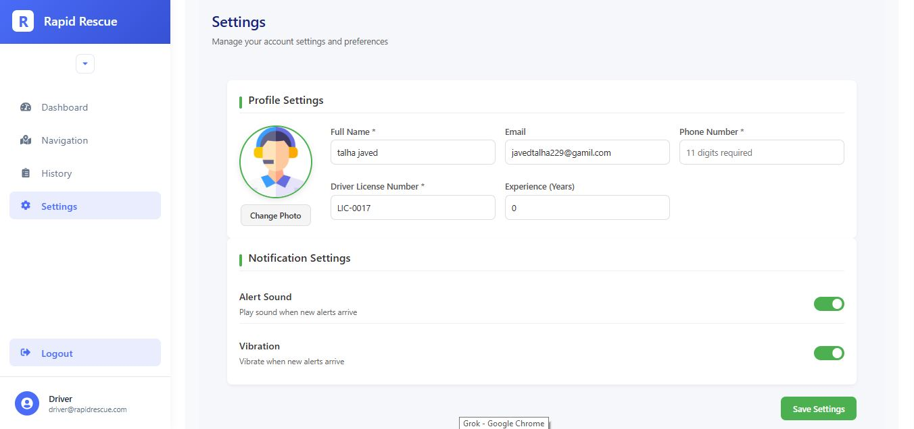
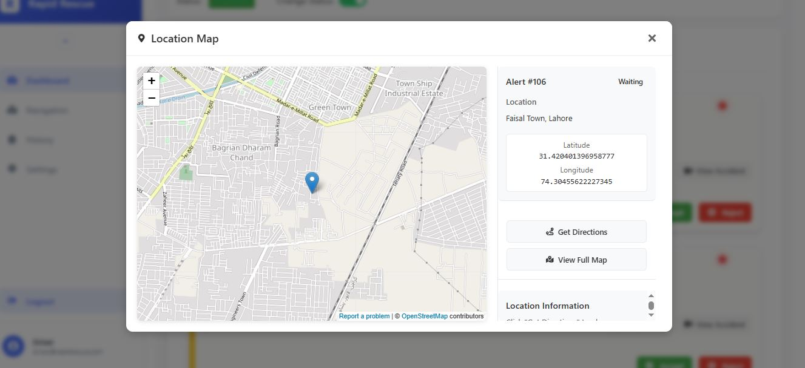

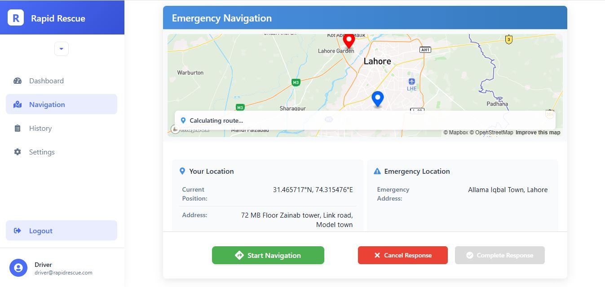


---


**Made with ❤️ for emergency response coordination**
